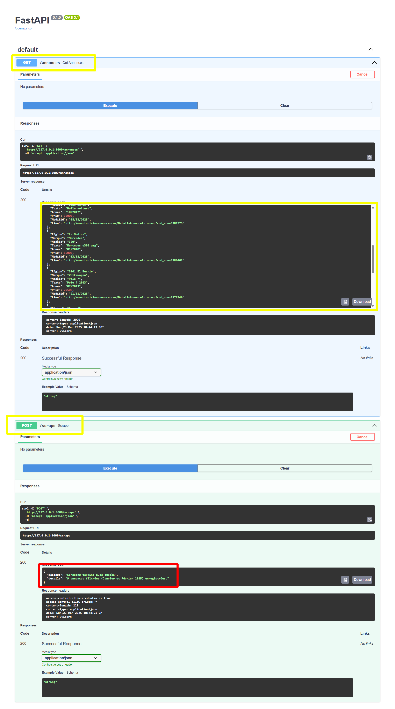
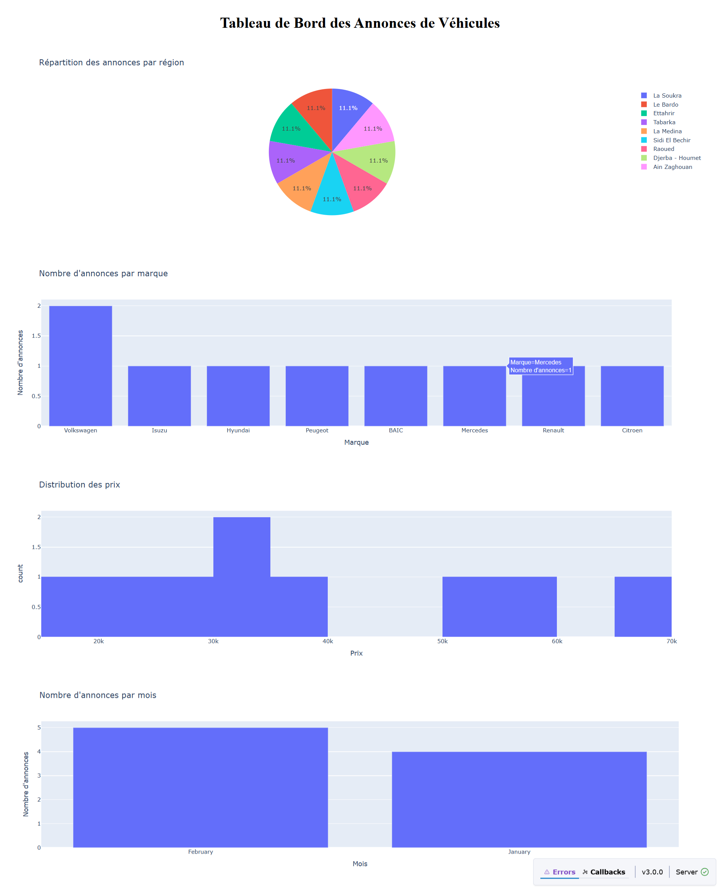

Web Scraping & Dashboard - Annonces Tunisie

🎯 Objectif du Projet :

1-Développer une solution complète permettant de :

2-Scraper les annonces de véhicules publiées en Tunisie (janvier & février 2025).

3-Stocker les données dans un fichier CSV.

4-Exposer les données via une API REST (FastAPI).

5-Créer un Dashboard interactif (Dash + Plotly) pour visualiser les statistiques

 🏧 Structure du Projet :
 📦 projet
 ├📄 scraper.py             → Scraping des annonces (Selenium)
 ├📄 main.py                → API REST (FastAPI)
 ├📄 dashboard.py           → Tableau de bord (Dash, Plotly)
 ├📄 annonces_vehicules.csv → Fichier CSV généré par scraping
 ├📄 requirements.txt       → Dépendances (pour api)
 ├📄 requirements2.txt      → Dépendances (pour dashboard)
 ├📄 README.md              → Documentation
 └📄 images                 → Captures d'ecran
   ├api_screenshot.png
   └dashboard_screenshot.png
 

  ⚙️ Installation et Configuration

  1️⃣ Cloner le projet
   git clone https://github.com/zeineb22/fastapi-scraper.git

  2️⃣ Installer les dépendances
   pip install -r requirements.txt
   ->fastapi
   ->uvicorn
   ->selenium
   ->pandas

   pip install -r requirements2.txt
   ->dash
   ->pandas
   ->plotly

  3️⃣ Installer ChromeDriver
   Téléchargez la version correspondant à votre navigateur Chrome :🔀 https://chromedriver.chromium.org/downloads

🚀 Lancement du projet

🌐 Partie 1 - API FastAPI
    1.Lancer l'API : python main.py
    2.tester via FastAPI Swagger : http://127.0.0.1:8000/docs
     ->  Endpoints disponibles : -GET /annonces : Retourne toutes les annonces scrapées
                                 -POST /scrape : Lance une session de scraping et met à jour le CSV
    3.Exemple API : 

📊 Partie 2 - Dashboard avec Dash & Plotly
     1.Lancer le dashboard :  python dashboard.py
     2.Accéder à : http://127.0.0.1:8050/
     3.Exemple Dashboard Screenshot : 

---->Fonctionnalités du Dashboard <-----

 📍 Camembert : Répartition par région

 🚗 Barres : Nombre d'annonces par marque

 💰 Histogramme : Distribution des prix

 📅 Barres : Nombre d'annonces par mois
     

